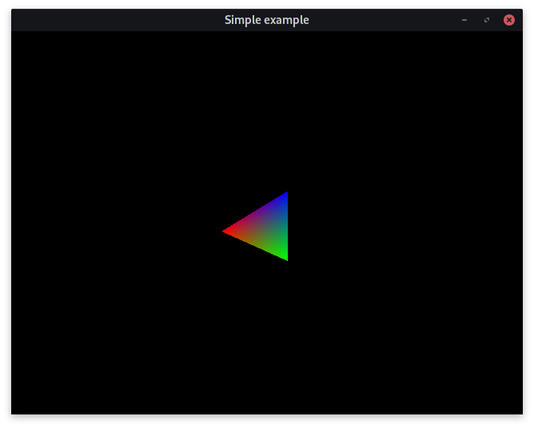

# 3D Viewer

Simple Application to Show the Art of 3D Programming and on How to Develop Your Own 3D Visualization Techniques

## Requirements
The viewer is based on OpenGL

- Standard: C++17
- Operating System: Linux | MacOS | Windows
- Compiler: GCC | Clang | MinGW | MSVC
- Build System: [build2](https://build2.org/)
- Libraries:
    + [GLFW](https://www.glfw.org/)
    + [glbinding](https://glbinding.org/)
    + [GLM](https://glm.g-truc.net/0.9.9/index.html)

## Build

If you are on Linux and you want to use GCC with highest optimization `cd` into the cloned project repository and use the following instruction.

    b config.cxx=g++ "config.cxx.coptions=-O3 -march=native"

Execute the compiled program by calling

    ./viewer

You should see something like the following.

